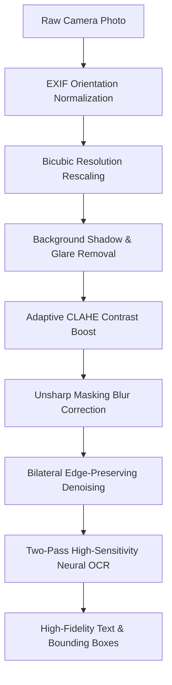

# 🧠 DocIQ — Advanced Intelligent Document Processing (IDP) Platform

[](https://www.python.org/)
[](https://streamlit.io/)
[](https://github.com/JaidedAI/EasyOCR)
[](https://streamlit.io/)
[](LICENSE)

**DocIQ** is an Intelligent Document Processing (IDP) platform built with Streamlit, EasyOCR, OpenCV, Sentence-Transformers, and PyMuPDF. It transforms raw document images, live camera captures, receipts, invoices, and scans into clean, structured, searchable, and semantically indexed data.

Featuring a modern light-mode interface, specialized live-camera enhancement (shadow removal & unsharp mask blur correction), comprehensive OCR accuracy measurement, and one-click multi-format export.

---

## 🎯 OCR Accuracy Measurement & Quality Metrics

DocIQ includes a built-in mathematical accuracy engine (`compute_accuracy_metrics` in `src/ocr_engine.py`) to quantify recognition fidelity before documents enter downstream workflows:

$$\text{Composite Accuracy Index} = (0.70 \times \text{Avg Confidence}) + (0.30 \times \text{Lexical Validity})$$

### 📊 Quality Grading Scale

| Grade | Accuracy Range | Quality Level | Recommended Action |
| :---: | :---: | :---: | :--- |
| **A+** | **90.0% – 100%** | Exceptional / Studio Scan | Production ready; automated ingestion |
| **A** | **80.0% – 89.9%** | High Accuracy | Production ready; standard documents |
| **B** | **68.0% – 79.9%** | Good / Readable | Acceptable; minor camera noise or tilt |
| **C** | **50.0% – 67.9%** | Moderate | Manual review recommended; poor lighting |
| **D** | **< 50.0%** | Low Accuracy | Retake capture with improved lighting |

### 📈 Evaluated Metrics & Indicators

- **Overall Accuracy Score (%)**: Composite index weighting deep neural confidence and linguistic token validity.
- **Confidence Distribution Breakdown**:
  - 🟢 **High Confidence (≥ 80%)**: Verified character accuracy.
  - 🟡 **Medium Confidence (50% – 79%)**: Legible text with minor ambiguity.
  - 🔴 **Low Confidence (< 50%)**: Borderline characters or background artifacts.
- **Lexical Validity (%)**: Ratio of extracted tokens containing valid alphanumeric structures vs. non-linguistic noise.
- **Reading Order Flow**: Directional vector connectivity ensuring natural left-to-right, top-to-bottom line sequencing.

---

## 📸 Live Photo & Camera Optimization Pipeline

Camera photos from smartphones and webcams present real-world challenges that cause standard OCR engines to fail. DocIQ integrates an automated camera pipeline (`src/preprocessor.py`):



1. **EXIF Orientation Correction**: Automatically transposes mobile photos that are rotated 90° or 270° by smartphone gyroscope metadata.
2. **Shadow & Glare Removal**: Morphological background approximation divides out uneven ambient room lighting and cast shadows.
3. **Unsharp Mask Sharpening**: Restores crisp stroke boundaries for slightly out-of-focus camera lenses.
4. **Two-Pass Neural Recognition**: If initial detection returns low word volume, DocIQ automatically launches a secondary high-sensitivity recognition pass.

---

## 🚀 Complete Feature Suite

### 1. 🖼️ Visual Canvas & Spatial Inspection (`src/visualizer.py`)
- **Bounding Boxes**: Confidence-coded overlays (Green ≥80%, Yellow 50–79%, Red <50%).
- **Confidence Heatmap**: Thermal spatial density map displaying model certainty across page regions.
- **Reading Order**: Numbered vectors tracing the natural human reading sequence.
- **Interactive Visual Search**: Search any keyword to immediately illuminate its exact bounding box in gold.

### 2. 🗂️ Structured Entity & Invoice Extraction (`src/extractor.py`)
- **Automated Document Classification**: Categorizes document as *Invoice / Receipt*, *Identity Document*, *Medical / Prescription*, *Legal / Contract*, or *Academic*.
- **Key-Value Parsing**: Invoice numbers, PO numbers, dates, monetary totals, subtotals, tax, discounts, emails, phones, and URLs.
- **PII Detection & Redaction**: Detects sensitive credentials (Aadhaar, PAN, Credit Cards, SSN) with optional 1-click `████` redaction.

### 3. 🧬 Semantic Embedding Vector Space (`src/embedder.py`)
- Transforms recognized text into 384-dimensional dense vectors using `sentence-transformers/all-MiniLM-L6-v2`.
- Projects embeddings to 2D via **PCA** or **t-SNE** with interactive **K-Means** clustering.
- Pairwise **Cosine Similarity Heatmaps** revealing conceptual relationships across document segments.

### 4. 📤 Multi-Format Export Center (`src/exporter.py`)
- **Searchable PDF**: Image combined with an invisible selectable text layer for native `Ctrl+F` search in Acrobat, Chrome, and Preview.
- **Annotated Audit PDF**: Comprehensive executive report with bounding box visual map, accuracy metrics, and word-by-word audit trail.
- **Structured JSON**: Machine-readable coordinates, confidence scores, and parsed entities.
- **CSV / Excel**: Tabular spreadsheet of words, coordinates, and confidence ratings.
- **Plain Text**: Formatted clean text with optional PII redaction.
- **All-In-One ZIP Archive**: Single-click package containing all export formats.

### 5. ✨ Multi-Input Sources
- **Upload Image**: Drag-and-drop support for JPG, PNG, and WEBP.
- **Preset Sample Documents**: Built-in Commercial Invoice and Retail Receipt generators (`src/sample_docs.py`) for instant testing without local files.
- **Camera Scanner**: Live webcam/mobile camera capture.

---

## 📁 Project Architecture

```
Text_Extracted/
├── app.py                 # Modern Light-Mode UI, accuracy gauge, canvas tabs, export center
├── requirements.txt       # Dependencies (Streamlit, EasyOCR, PyTorch, OpenCV, ReportLab)
├── README.md              # Documentation, architecture, and accuracy evaluation guide
└── src/
    ├── __init__.py        # Package initialization
    ├── preprocessor.py    # EXIF fix, shadow removal, unsharp mask, deskew, CLAHE
    ├── ocr_engine.py      # EasyOCR GPU engine, two-pass recognition, accuracy metrics
    ├── visualizer.py      # Bounding boxes, confidence heatmap, reading order flow
    ├── extractor.py       # Key-value invoice fields, dates, amounts, PII detection
    ├── embedder.py        # Sentence-transformers embedding & 2D dimensionality reduction
    ├── exporter.py        # Searchable PDF, Audit PDF, JSON, CSV, TXT, and ZIP bundle
    └── sample_docs.py     # Synthetic document generator for 1-click demo testing
```

---

## ⚙️ Installation & Quick Start

### 1. Clone the Repository
```bash
git clone https://github.com/Goutam16-Withcode/Text_Extracted.git
cd Text_Extracted
```

### 2. Install Dependencies
```bash
pip install -r requirements.txt
```

### 3. Launch the Application
```bash
streamlit run app.py
```
Open **http://localhost:8501** in your browser to begin.

---

## 🛡️ Privacy & Compliance
- **100% Local Inference**: All OCR processing, image filtering, and vector embeddings execute entirely on your local machine.
- **PII Redaction**: Sensitive personal credentials can be automatically masked (`████`) before exporting.

---

## 📄 License
This project is open-source and available under the [MIT License](LICENSE).
